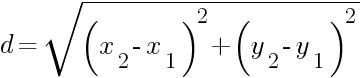

# Sistema de Simulación de Transporte Urbano

Esta es una aplicación de práctica para conceptos de POO en Python. La aplicación es un sistema de simulación de 
transporte urbano con las siguientes características:

- Agregar autobuses.
- Asignar rutas a los autobuses.
- Ver autobuses por estado o por ruta.
- Actualizar el estado de un autobús.
- Actualizar el número de asientos ocupados.
- Actualizar la ubicación de un autobús.
- Calcular la distancia de un autobús a un destino específico.
- Ver el resumen general de los autobuses.

El modelo de dominio de la aplicación es el siguiente:

[](assets/transport-manager-model.png)

Tu tarea es el modelo en el archivo `app/model.py`. Considera los siguientes aspectos para la implementació:

## 1. Clase `Bus`

- La clase debe ser implementada como una dataclass.
- La clase debe tener las siguientes constantes como variables de clase:
  - `STATUS_EN_RUTA` de tipo `str` con valor `'en ruta'`.
  - `STATUS_EN_TERMINAL` de tipo `str` con valor `'en terminal'`.
- La clase debe tener los siguientes atributos:
  - `id` de tipo `int` inicializado en el contructor.
  - `route` de tipo `str` inicializado en el contructor y con valor por defecto `""`
  - `capacity` de tipo `int` inicializado en el contructor y con valor por defecto `0`.
  - `occupied_seats` de tipo `int` inicializado en el contructor y con valor por defecto `0`.
  - `status` de tipo `str` **no** inicializado en el constructor y con valor por defecto `STATUS_EN_TERMINAL`.
  - `location` de tipo `tuple[int, int]` **no** inicializado en el constructor y con valor por defecto `(0, 0)`.
  
    > **Consejo**: Puedes utilizar la función `field` de la librería `dataclasses` para definir los atributos `status` 
    y `location`.

- La clase debe tener un método de instancia `assign_route` que reciba un parámetro `route` de tipo `str` y asigne el
valor al atributo de instancia `route`.
- La clase debe tener un método de instancia `update_occupied_seats` que reciba un parámetro `occupied_seats` de tipo
`int` y asigne el valor al atributo de instancia `occupied_seats`. El método solo debe hacer la asignación si el valor
de `occupied_seats` es mayor o igual a 0 y menor o igual al atributo `capacity`.
- La clase debe tener un método de instancia `toggle_status` que cambie el valor del atributo `status` de `STATUS_EN_RUTA`
a `STATUS_EN_TERMINAL` y viceversa.
- La clase debe tener un método de instancia `update_location` que reciba dos parámetros `new_x` y `new_y` de tipo `int` y
asigne el valor al atributo de instancia `location`.

  > **Pista**: Recueda que `location` es una tupla, por lo que no se puede modificar directamente. Puedes crear una nueva
    tupla con los valores `new_x` y `new_y`.
 
- La clase debe tener un método de instancia `calculate_distance` que reciba dos parámetros `dest_x` y `dest_y` de tipo 
`int` que representan las coordenadas de un destino. El método debe calcular la distancia entre la ubicación actual del
autobús y el destino y retornar el valor.

  > **Pista**: Puedes utilizar la fórmula de la distancia euclidiana para calcular la distancia entre dos puntos en un
    plano cartesiano: 
    [](assets/distance_eq.png)
    <br>puedes utilizar la función `sqrt` del módulo `math` para calcular la raíz cuadrada.

## 2. Clase `TransportManager`

- La clase **no** se debe implementar como una dataclass.
- La clase debe tener un atributo de instancia `buses` de tipo `dict[int, Bus]` inicializado en el constructor con un 
diccionario vacío.
- La clase debe tener un método de instancia `add_bus` que reciba un parámetro `capacity` de tipo `int` y cree una nueva
instancia de `Bus` con un `id` único (generado como el número de elementos en la lista `buses` más 1) y el valor de 
`capacity` recibido como parámetro. La instancia debe ser agregada a al diccionario `buses` con el `id` como clave.
- La clase debe tener un método de instancia `assign_route` que reciba dos parámetros `bus_id` de tipo `int` y `route` de
tipo `str` y asigne la ruta al autobús con el `id` recibido como parámetro.
- La clase debe tener un método de instancia `buses_by_status` que reciba un parámetro `status` de tipo `str` y retorne
una `list[Bus]` con los autobuses que tengan el atributo `status` igual al valor recibido como parámetro.
- La clase debe tener un método de instancia `buses_by_route` que reciba un parámetro `route` de tipo `str` y retorne
una `list[Bus]` con los autobuses que tengan el atributo `route` igual al valor recibido como parámetro.
- La clase debe tener un método de instancia `update_bus_location` que reciba tres parámetros `bus_id`, `new_x` y `new_y`
de tipo `int`. El método debe actualizar la ubicación del autobús con el `bus_id` para que tenga las coordenadas
`new_x` y `new_y`.
- La clase debe tener un método de instancia `calculate_distance_to_destination` que reciba tres parámetros `bus_id`,
`dest_x` y `dest_y` de tipo `int`. El método debe calcular la distancia entre la ubicación actual del autobús con el
`bus_id` y el destino con las coordenadas `dest_x` y `dest_y` y retornar el valor. Si el autobús no existe, el método
debe retornar `-1`.
- La clase debe tener un método de instancia `summary` que retorne un `str` con un resumen de los autobuses en ruta y en
terminal. El resumen debe tener el siguiente formato:

  ```plaintext
  Buses en ruta: n, Buses en terminal: m
  ```
  
    Donde `n` es el número de autobuses en ruta y `m` es el número de autobuses en terminal.
